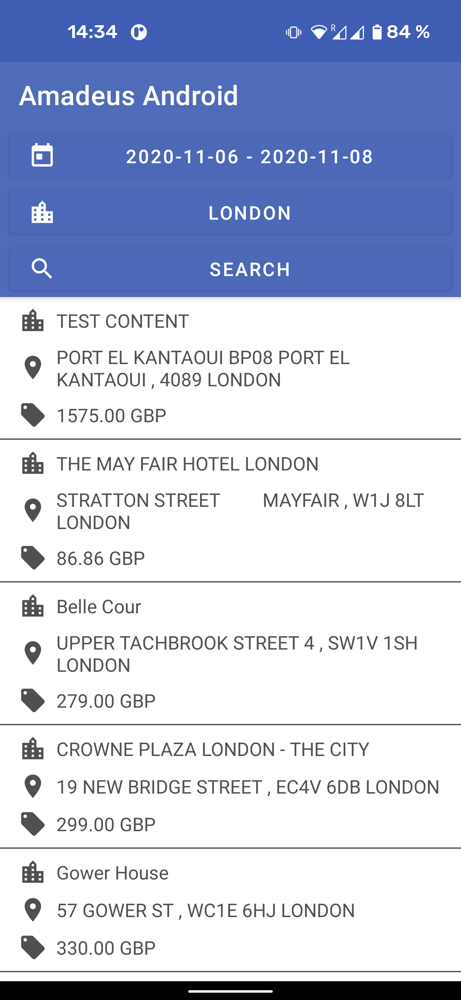
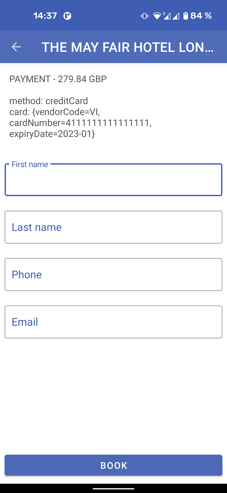

# Amadeus Android (Kotlin) - How to build an Hotel Booking Engine

In this article, we are going to look at how to build a hotel booking engine with the [Amadeus Self-Service APIs on Android](https://github.com/amadeus4dev/amadeus-android/). For more information on how the hotel APIs work please take a look at our blog article ["Build a hotel booking engine with Amadeus Self-Service APIs"](https://developers.amadeus.com/blog/build-hotel-booking-engine-amadeus-api).

For a good start, plese take a look at our article explaining how to configure and setup your dev environment here: [[insert article link]].

## Application architecture quick overview

As the Android Amadeus SDK is built to take advantage of [Kotlin's coroutines](https://kotlinlang.org/docs/reference/coroutines-overview.html) to handle asynchronous calls, the demo is written in the same language. Because the Amadeus API client is not a singleton, we keep the same instance of the client stored inside the Application object as a public field.

We've developed this project around the concept of [Single-Activity application](https://www.youtube.com/watch?v=2k8x8V77CrU). Which is a well-known pattern recommended by Google for building Android apps. To help us, we use the [Android Jetpack Navigation](https://developer.android.com/guide/navigation) component, to easily move from a screen to another, and the [Android Jetpack Lifecycle](https://developer.android.com/topic/libraries/architecture/livedata) component to handle UI updates.
Every screen in the demo is made of a unique fragment to display content, paired with a ViewModel to query and send data to the UI.

## Part 0 - Getting the location

Before being able to proceed with Part 1 of the article, we need to get the location where we will search for  hotels, basically where the traveler wants to go. The [Hotel Search API](https://developers.amadeus.com/self-service/category/hotel/api-doc/hotel-search/api-reference) uses the [IATA City Code](https://www.iata.org/en/publications/directories/code-search/) as query parameter. To find a city code based on a city name we will use the [Airport & City Search API](https://developers.amadeus.com/self-service/category/air/api-doc/airport-and-city-search/api-reference) which offers auto-complete search and returns the IATA city code. There are more parameters that you can use with this endpoint, to keep it simple we will stick with the city code.

We retrieve the user input (name of the city the traveler wants to visit) and we pass it to the view model that processes the data.

```kotlin
// LocationViewModel

private val _loading = MutableLiveData<Boolean>()
val loading: LiveData<Boolean>
    get() = _loading

val error = SingleLiveEvent<String>()

private val _locations = MutableLiveData<List<Location>>()
val locations: LiveData<List<Location>>
    get() = _locations

fun searchLocations(location: String) {
    viewModelScope.launch {
        _loading.value = true
        when (
            val result = SampleApplication
                .amadeus
                .referenceData
                .locations
                .get(listOf("CITY"), location) // We search only for cities, not airports
            ) {
                is ApiResult.Success -> _locations.value = result.data
                else -> error.value = "Something wrong happened with your request."
            }
            _loading.value = false
        }
    }
```

We use 3 different LiveData objects to pass information to the UI.

* _loading: is used to notify that a request is ongoing and we should display a loading indicator for the user.

* _locations: this is where we will push the data from API to let the fragment display the list of locations.

* error: if the API doesn't return a Success object, we need to provide the user with a meaningful human readable message.

Each of those values is observed by the `LocationFragment` who updates the UI accordingly.

We launch the request through the `viewModelScope`, which is a special coroutine scope automatically canceled when the view model is not used. Preventing from UI updates outside the fragment lifecycle. Every API call is ran with a suspend function inside the `Dispatchers.IO` scope, making the API 100% thread-safe.

Every API call returns an `ApiResult` subtype object. It's a wrapper around data and metadata Amadeus API returns, like next/previous links, different dictionaries, and more.

* `ApiResult.Success`: contains a ready to use typed data value, some metadatas and dictionaries.

* `ApiResult.Error`: contains the status code, error code and message of the API response.

We pass the response of the Airport & City Search API through `_locations` live data to the observing fragment, it displays the values so the user can choose the city and we can move to the first part of the hotel booking process.


## Part 1 - Search hotels by location using the Find Hotels endpoint

We will use the first endpoint of the [Hotel Search API](https://developers.amadeus.com/self-service/category/hotel/api-doc/hotel-search/api-reference) to find the list of available hotels in a specific city: we pass the city code obtained earlier, the check-in and check-out dates as query parameters.

```kotlin
// HotelsOffersViewModel

private var latestResult: Success<List<HotelOffer>>? = null

fun searchByDestination(
    destination: String,
    checkInDate: LocalDate?,
    checkOutDate: LocalDate?
) {
    this.checkInDate = checkInDate.toString()
    this.checkOutDate = checkOutDate.toString()
    viewModelScope.launch {
        _loading.value = true
        when (val result = SampleApplication.amadeus.shopping.hotelOffers.get(
            cityCode = destination,
            checkInDate = checkInDate.toString(),
            checkOutDate = checkOutDate.toString()
        )) {
            is Success -> {
                if (result.data.isNotEmpty()) {
                    latestResult = result
                    _hotelOffers.value = result.data
                } else {
                    //call returned without data
                    error.value = "No result for your research"
                }
            }
            is Error -> error.value = "Error when retrieving data."
        }
        _loading.value = false
    }
}
```

We use the same technique described in Part 0 to pass data to the UI. With this request, it could be useful to use pagination to provide more results to the user.
This is the reason why we keep track of the request's result.

To request more data, we check if the result has a next link meta using the `result.hasNext()` method and we pass this link to the `amadeus.get(URL)` request.

```kotlin
// HotelsOffersViewModel

fun loadMore() {
    viewModelScope.launch {
        latestResult?.let {
            if (it.hasNext() == false) return
            when (val next = SampleApplication.amadeus.next(it)) {
                is Success -> {
                    if (next.data.isNotEmpty()) {
                        val list = mutableListOf<HotelOffer>().apply {
                            addAll(latestResult.data)
                            addAll(next.data)
                        }
                        latestResult = next
                        _hotelOffers.value = list
                    } else {
                        //call return without data
                        error.value = "No result for your research"
                    }
                }
            }
        }
    }
}
```

The demo contains an example of how you can implement the `next` call, with a loading indicator at the bottom of the list. It's using a wrapper object to differentiate between real results and list loading indicator who launch next request when displayed. You should use the way that suits best your architecture. Note that the Android Jetpack Components have a library for that [Paging 3.0.0](https://developer.android.com/topic/libraries/architecture/paging), but it was still in development at the moment of this article.

Once the user selects a hotel, we can use the second endpoint to show all the available offers (combinations of rooms, services and prices).



## Part 2 - See rates for a chosen hotel using the View Hotel Rooms endpoint

With the hotel id obtained from the previous API response and dates, we can directly prepare the new request to display the different hotel offers of a given hotel. For this, we use `shopping.hotelOffersByHotel.get(...)` endpoint.

```kotlin
// RatesViewModel

private val _hotelOffer = MutableLiveData<HotelOffer>()
val hotelOffer: LiveData<HotelOffer>
    get() = _hotelOffer

private val _loading = MutableLiveData<Boolean>()
val loading: LiveData<Boolean>
    get() = _loading

val error = SingleLiveEvent<String>()

init {
    fetchRates()
}

private fun fetchRates() {
    viewModelScope.launch {
        _loading.value = true
        val amadeus = SampleApplication.amadeus
        when (val result =
            amadeus.shopping.hotelOffersByHotel.get(hotelId, checkInDate, checkOutDate)) {
            is Success -> _hotelOffer.value = result.data
            else -> {}
        }
        _loading.value = false
    }
}
```

As explained in the Hotel Booking Engine tutorial, after selecting a room you need to confirm its price before booking it.
When the user selects an offer, you can pass the `offerId` to the next screen and call the third endpoint of the Hotel Search API to get the final offer price.


## Part 3 - Get the final price and conditions using the View Room Details endpoint

Using `shopping.hoetlOffer(id).get()`, we will show the user a summary with the final price of the offer he selected.

```kotlin
// PriceViewModel

init {
    fetchPrice()
}

private fun fetchPrice() {
    viewModelScope.launch {
        _loading.value = true
        val amadeus = SampleApplication.amadeus
        when (val result = amadeus.shopping.hotelOffer(offerId).get()) {
            is Success -> _hotelOffer.value = result.data
            else -> {}
        }
        _loading.value = false
    }
}
```



We have a button on this page to allow the user to book. To proceed with the booking, you should ask your customers for their personal and payment information, in our case, for demo purposes we will create a fake credit card and use the `booking.hotelBooking.post(...)` endpoint.

```kotlin
// PriceViewModel

// This is a fake credit card number provided by VISA for testing
val payments = arrayOf(
    mapOf(
        "method" to "creditCard",
        "card" to mapOf(
            "vendorCode" to "VI",
            "cardNumber" to "4111111111111111",
            "expiryDate" to "2023-01"
        )
    )
)

fun postHotelBooking(
    firstName: String,
    lastName: String,
    phone: String,
    email: String
) {
    viewModelScope.launch {
        _loading.value = true
        val amadeus = SampleApplication.amadeus
        val name = mapOf(
            "firstName" to firstName,
            "lastName" to lastName
        )
        val contact = mapOf(
            "phone" to phone,
            "email" to email
        )
        val hotelBookingQuery = mapOf<String, Any>(
            "offerId" to offerId,
            "guests" to arrayOf(
                mapOf(
                    "name" to name,
                    "contact" to contact
                )
            ),
            "payments" to payments
        )
        when (
            val result = amadeus
                .booking
                .hotelBooking
                .post(mapOf("data" to hotelBookingQuery))
            ) {
                is Success -> bookingResult.value = result.data.firstOrNull()
                else -> error.value = "Error with your booking."
            }
        _loading.value = false
    }
}
```

You now know how to build your own Hotel booking engine on Android! You can find the complete project in open-source in our [GitHub](https://github.com/amadeus4dev/amadeus-hotel-booking-android).

We hope you'll have as much pleasure using the Android Amadeus SDK as we had making it!
